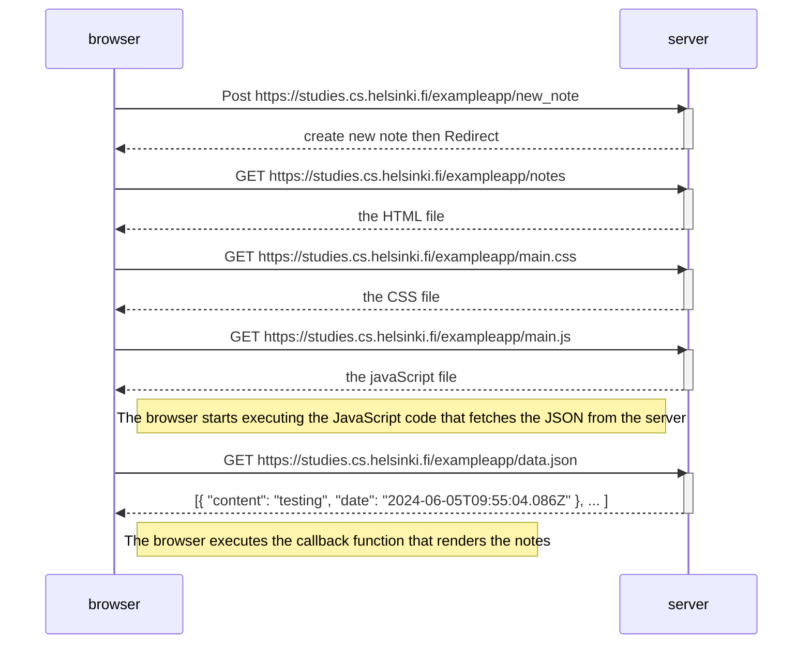

```mermaid
sequenceDiagram
    participant browser
    participant server

    browser->>server: Post https://studies.cs.helsinki.fi/exampleapp/new_note
    activate server
    server-->>browser:create new note then Redirect
    deactivate server

    browser->>server: GET https://studies.cs.helsinki.fi/exampleapp/notes
    activate server
    server-->>browser: the HTML file
    deactivate server

    browser->>server: GET https://studies.cs.helsinki.fi/exampleapp/main.css
    activate server
    server-->>browser: the CSS file
    deactivate server

    browser->>server: GET https://studies.cs.helsinki.fi/exampleapp/main.js
    activate server
    server-->>browser: the javaScript file
    deactivate server

    Note right of browser: The browser starts executing the JavaScript code that fetches the JSON from the server

    browser->>server: GET https://studies.cs.helsinki.fi/exampleapp/data.json
    activate server
    server-->>browser: [{ "content": "testing", "date": "2024-06-05T09:55:04.086Z" }, ... ]
    deactivate server

    Note right of browser: The browser executes the callback function that renders the notes
```
