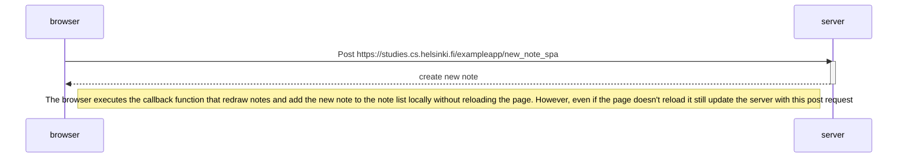

```mermaid
sequenceDiagram
    participant browser
    participant server

    browser->>server: Post https://studies.cs.helsinki.fi/exampleapp/new_note_spa
    activate server
    server-->>browser:create new note 
    deactivate server

    Note right of browser: The browser executes the callback function that redraw notes and add the new note to the note list locally without reloading the page. However, even if the page doesn't reload it still update the server with this post request
```
